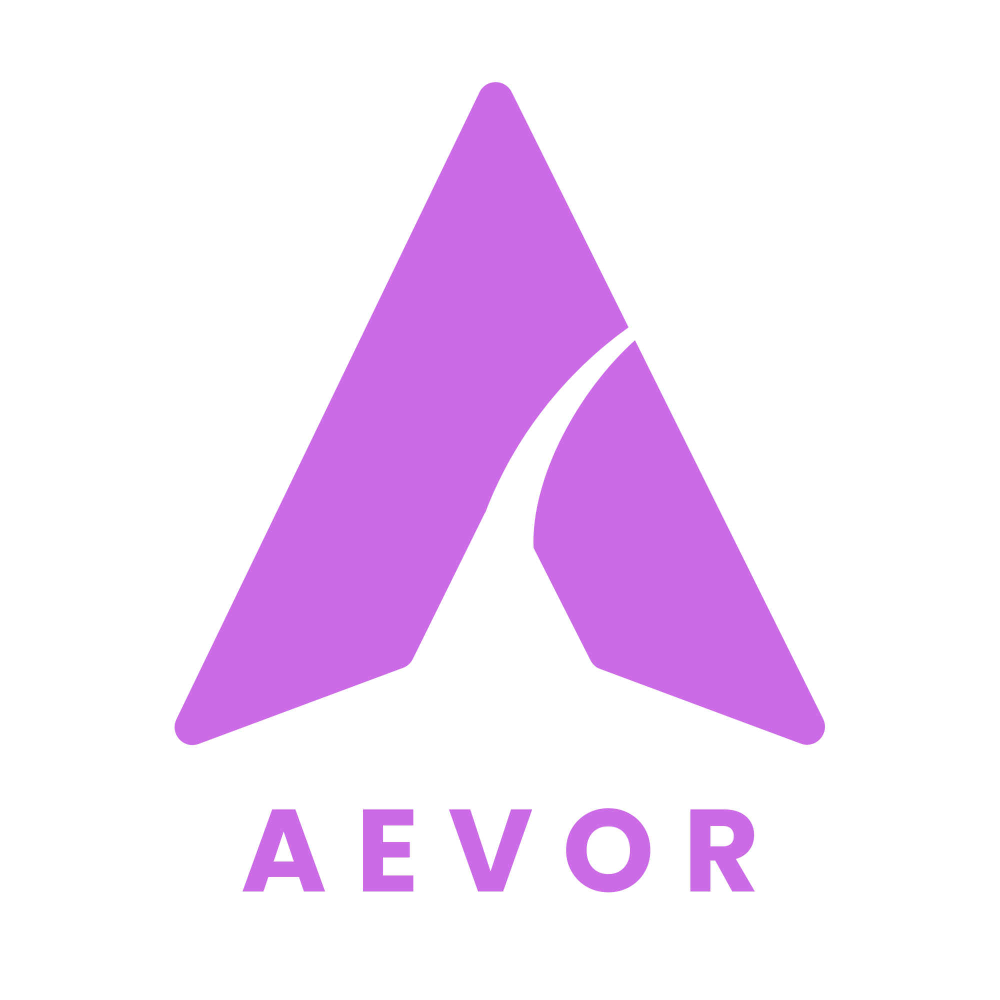

<p align="center">
  
</p>

<h1 align="center">Aevor</h1>

<p align="center">
  A premium desktop profile management and backup suite for <b>Brave Browser</b> on Windows.
</p>

<p align="center">
  
  
  
</p>

<p align="center">
  
</p>

---

## About

Aevor is a desktop application built specifically for managing and backing up Brave Browser profiles on Windows. It gives you a single interface to discover every profile on your machine, inspect what each one contains, clone or template profiles across each other, scan for exposed sensitive data before you share or export a profile, and take secure, integrity verified backups you can restore later. The application follows a Clean Architecture layout under the hood, which keeps the domain logic, service interfaces, and infrastructure implementations cleanly separated from the WPF UI.

---

## Features

- **Profile Discovery**
  Detects local Brave installations by resolving the standard Windows app data path, then parses the `Local State` file to enumerate every profile with its real display name, avatar, and default or last used status.

- **Profile Analysis**
  Reads a profile's `Preferences` and `Secure Preferences` files to extract search engine settings, sidebar and tab configuration, and installed extensions. The results are saved into a local JSON settings registry (`discovered_settings.json` under `%APPDATA%\Aevor\Discovery\`).

- **Templates and Extension Cloning**
  Lets you save the configuration and extensions from one profile as a reusable template, then apply it to other profiles. Extension settings and their DPAPI HMAC signatures are copied verbatim so Brave accepts them without rejecting the config, and the underlying extension folders are copied to disk alongside the settings.

- **Profile Cloning**
  Creates a full duplicate of a profile on the same machine, with the option to exclude sensitive or heavy data such as saved passwords, active session cookies, and cache folders during the copy.

- **Security Scanner**
  Checks a profile for exposed credentials, cookies, autofill and credit card data, browsing history, and cryptocurrency wallet files, then produces a weighted risk score along with a downloadable PDF report.

- **Argon2id Master Password Vault**
  Protects app settings and backups behind a master password hashed with Argon2id (64 MB memory cost, 4 iterations, 8 way parallelism), with the derived key wiped from memory immediately after use.

- **Backup and Restore**
  Archives a profile's files, excluding caches and lock files, to a local backup folder, calculates a SHA-256 hash of the full directory structure, and verifies that hash again before restoring to make sure nothing was corrupted in between.

---

## Architecture

Aevor follows Clean Architecture principles, separating the codebase into four layers:

```
Aevor.UI  →  Aevor.Application  →  Aevor.Core
Aevor.Infrastructure  →  Aevor.Application
```

| Layer | Responsibility |
|---|---|
| `Aevor.Core` | Domain models, constants, and custom exceptions. No external dependencies. |
| `Aevor.Application` | Interfaces and service contracts that define the application boundary. |
| `Aevor.Infrastructure` | Implements the application interfaces, including file system access, cryptography, and serialization. |
| `Aevor.UI` | WPF front end with a glassmorphic design, consuming services through dependency injection. |

---

## Download and Installation

The easiest way to run Aevor is to download the prebuilt executable, no build tools or source setup required.

1. Go to the [Releases](https://github.com/Rahul-Muthuswamy/aevor/releases) page.
2. Download the latest `Aevor.exe`.
3. Run it directly on a Windows machine with Brave Browser installed.

**Requirements:**
- Windows 10 or later
- Brave Browser installed
- .NET Desktop Runtime (if not already present, Windows will prompt you to install it)

---

## Usage

1. Launch `Aevor.exe`.
2. Aevor will automatically detect your Brave installation and list all available profiles.
3. Select a profile to view its details, run a security scan, create a template, clone it, or back it up.
4. For backups, use the Restore option and point Aevor to a saved backup. It will verify file integrity before writing anything back.

---

## Contributing

Contributions are welcome, whether that's fixing a bug, improving documentation, or adding a new feature. Here is how to get set up.

1. Fork the repository.
2. Clone your fork locally.
   ```
   git clone https://github.com/<your-username>/aevor.git
   ```
3. Open `Aevor.sln` in Visual Studio.
4. Create a new branch for your change.
   ```
   git checkout -b feature/your-feature-name
   ```

Aevor follows Clean Architecture, so please keep changes within the right layer as described in the Architecture section above.

A few guidelines to keep in mind:

- Keep pull requests focused on a single change or fix.
- Match the existing naming conventions and code style.
- If your change touches sensitive data handling, like passwords, cookies, wallets, or backups, explain the reasoning clearly in the pull request description.
- Test your changes locally with a real or sample Brave profile before submitting.
- Update this README if your change affects features, usage, or requirements.

**Reporting bugs:** Open an issue and include steps to reproduce, what you expected versus what actually happened, your Windows and Brave version, and any relevant screenshots or logs.

**Suggesting features:** Open an issue describing the feature, why it would be useful, and any relevant context. For larger changes, it helps to discuss the approach before jumping into implementation.

**Submitting a pull request:** Push your branch to your fork, open a pull request against `main`, describe what the change does and why, and link any related issues.

All contributors are expected to follow the [Code of Conduct](contribution.md#code-of-conduct).

---

## License

MIT © Aevor Contributors